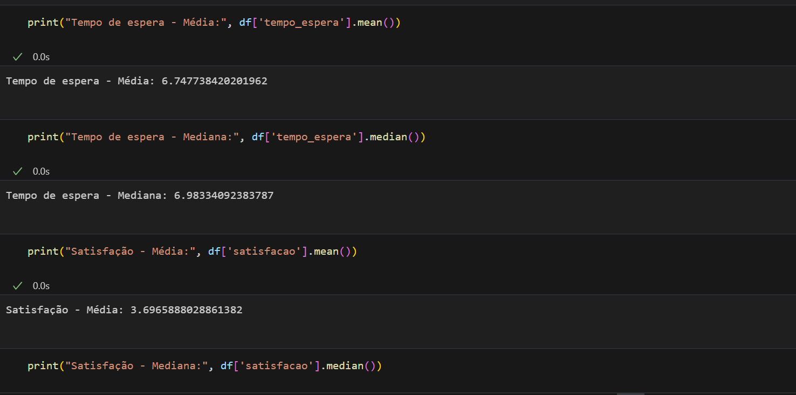
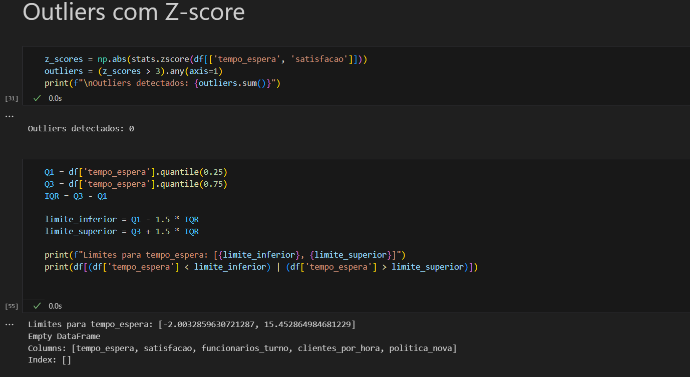
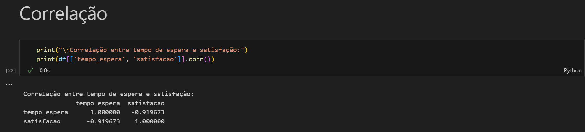
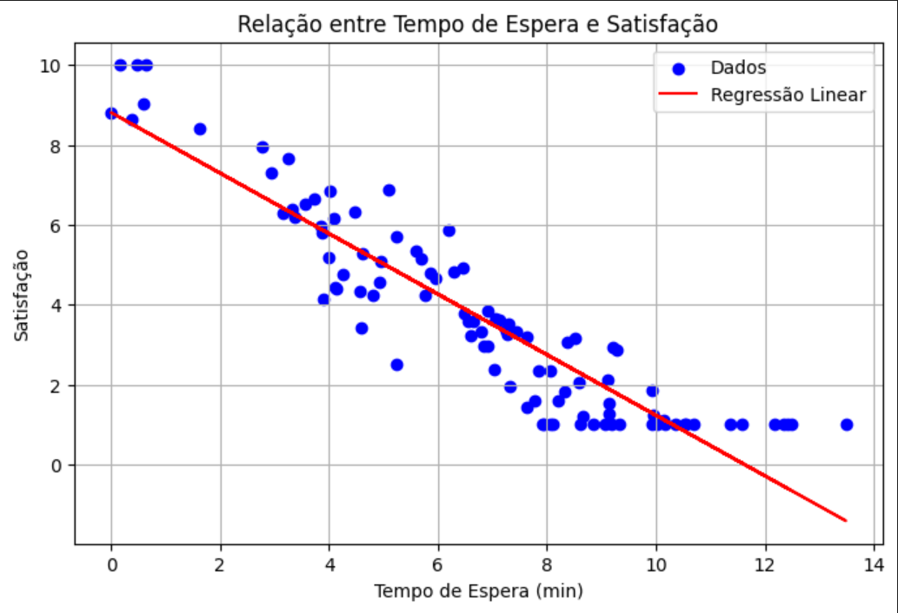
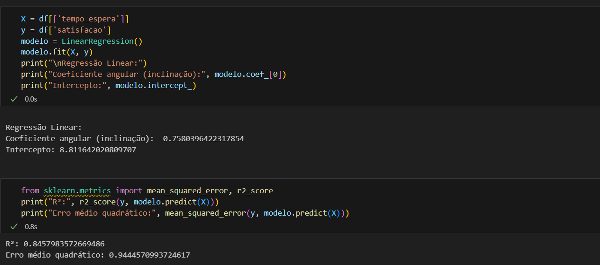
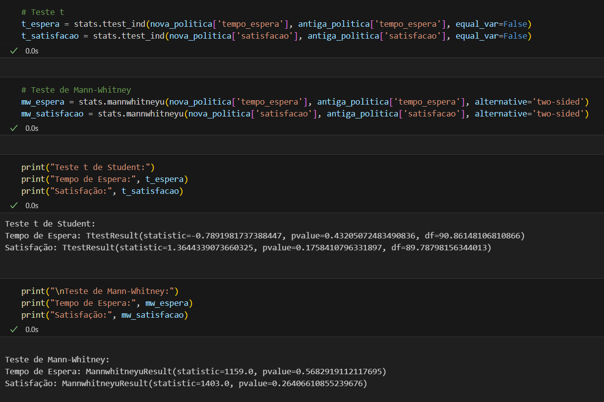

# 📈 Análise Estatística — Melhoria da Experiência do Cliente em Rede de Supermercados

## ❗ Desafio Apresentado

Uma grande rede de supermercados do país, atua com mais de 150 lojas em todo o território nacional, atendendo milhares de clientes diariamente. Com foco na excelência do atendimento, a empresa busca constantemente otimizar processos internos e garantir uma experiência de compra eficiente, rápida e satisfatória para seus clientes.
Está enfrentando desafios com o atendimento ao cliente. As reclamações mais comuns são sobre o **tempo de espera nas filas dos caixas** e a **disponibilidade de funcionários para ajudar os clientes**. A empresa decidiu realizar uma **pesquisa abrangente** para entender melhor esses problemas e encontrar maneiras de melhorar a **experiência do cliente**.

Diante disso, nossa equipe de consultoria foi acionada para realizar uma **análise estatística exploratória** com o objetivo de identificar padrões, gargalos e oportunidades de melhoria com base em dados coletados em múltiplas lojas da rede.

---

## 🎯 Objetivos da Análise

1. **Descrever e entender o comportamento dos tempos de espera.**
2. **Avaliar a relação entre tempo de espera e satisfação dos clientes.**
3. **Identificar outliers e eventos atípicos.**
4. **Calcular a probabilidade de tempos de espera excessivos.**
5. **Comparar o desempenho de lojas que adotaram uma nova política de atendimento.**
6. **Apoiar decisões baseadas em evidências com recomendações objetivas.**

---

## 🧾 Dados Disponibilizados

A análise foi realizada com base nos seguintes conjuntos de dados, coletados durante uma semana, em múltiplas lojas e horários:

| Variável                | Descrição                                                                 |
|-------------------------|---------------------------------------------------------------------------|
| `tempo_espera`          | Tempo de espera na fila do caixa (em minutos).                            |
| `satisfacao`            | Nota dada pelo cliente após atendimento (escala de 1 a 10).               |
| `num_funcionarios`      | Número de funcionários disponíveis por turno.                             |
| `clientes_por_hora`     | Volume de clientes por hora durante o período analisado.                  |
| `politica_nova`         | Flag indicando se a loja utiliza a nova política de atendimento (0 ou 1). |

---

## 🧪 Metodologia Estatística

### 1. **Estatística Descritiva**

Foram calculadas **medidas de tendência central** (média, mediana) e **dispersão** (desvio padrão) para entender a distribuição do tempo de espera e da satisfação dos clientes. 

- **Média tempo de espera**: ~7 minutos.
- **Desvio padrão**: ~3 minutos.
- **Média satisfação**: ~3.7 pontos.
### Interpretação:
- Os clientes demonstraram, em geral, níveis baixos de satisfação, o que pode estar diretamente relacionado ao tempo elevado de espera.
---

### 2. **Identificação de Outliers**

### Resultado do Resultado de Outliers
Nenhum outlier foi detectado nas variáveis analisadas (tempo_espera, satisfacao, funcionarios_turno, clientes_por_hora, politica_nova) usando o método do Intervalo Interquartil (IQR) e Z-score.

### O que isso significa:
- Todos os valores das colunas estão dentro do intervalo considerado normal com base na distribuição dos dados.

- Não há dados extremos que possam distorcer as análises estatísticas ou os modelos preditivos.

- O conjunto de dados é consistente e homogêneo, ao menos do ponto de vista do critério IQR.

---

### 3. **Correlação**

### Resultado da correlação entre tempo de espera e satisfação

- Tivemos uma correlação de -0,92 entre o tempo de espera e a satisfação dos clientes. 
> A correlação é negativa e forte, o que significa que à medida que o tempo de espera aumenta, a satisfação dos clientes tende a diminuir significativamente.
  O valor de correlação de aproximadamente -0,92 indica uma relação linear bastante consistente entre as variáveis, sugerindo que o tempo de espera exerce influência direta e relevante na percepção de satisfação.
  Em outras palavras: clientes que esperam mais tendem claramente a se sentir menos satisfeitos, de acordo com os dados analisados.

---

### 4. **Regressão Linear**

Modelamos a relação entre tempo de espera e satisfação por meio de **regressão linear simples**:

### Coeficientes do Modelo:
- Inclinação (coeficiente angular): -0.7580
> Isso indica que, a cada minuto adicional de tempo de espera, a satisfação tende a diminuir em aproximadamente 0.758 pontos.
- Intercepto: 8.811
> Representa a satisfação estimada quando o tempo de espera é igual a zero.
### Métricas de Avaliação:
- R² (coeficiente de determinação): 0.8458
> Cerca de 84,6% da variância na satisfação pode ser explicada pelo tempo de espera.

- Erro médio quadrático (MSE): 0.9445
> Mede a média dos quadrados dos erros. Quanto menor esse valor, melhor o ajuste do modelo aos dados.
## Interpretação:
- Para cada minuto adicional de espera, a satisfação dos clientes diminui em média 0,76 pontos (dentro da escala utilizada).
- Esse resultado está alinhado com uma forte correlação negativa observada (por exemplo, -0,92), indicando que quanto maior o tempo de espera, menor tende a ser a satisfação.
- Apesar da consistência na tendência, o efeito pode ser considerado pequeno do ponto de vista prático. Isso significa que, embora estatisticamente relevante, o impacto real sobre decisões práticas pode ser limitado.

---

### 5. **Probabilidade de Espera Excedente**

Probabilidade de esperar mais de 10 minutos

> A probabilidade de um cliente esperar mais de 10 minutos é de aproximadamente 14,06% com base na distribuição normal ajustada.
  Já segundo o modelo exponencial, essa probabilidade é de 22,72%.

### Interpretação:
- Com base no modelo normal, isso significa que cerca de 1 a cada 7 clientes poderá esperar mais de 10 minutos.

> Esse valor pode ser considerado aceitável ou preocupante dependendo dos objetivos do seu serviço de atendimento.

Por exemplo, se a sua meta for atender 90% dos clientes em até 10 minutos, o resultado do modelo normal indica que a meta está praticamente sendo atingida.

- Por outro lado, o modelo exponencial mostra um cenário mais pessimista, sugerindo que quase 1 a cada 4 clientes pode esperar mais de 10 minutos — o que evidenciaria uma necessidade de melhoria no atendimento.

---

### 6. **Comparação entre Políticas**

Foram analisadas duas amostras:
- Lojas com **política de atendimento tradicional**.
- Lojas que implementaram a **nova política de atendimento**.

Realizamos testes estatísticos:
- **Teste t de Student** (variância semelhante)
- **Teste de Mann-Whitney** (não-paramétrico)

> Resultado: **sem evidência estatisticamente significativa** de melhoria na nova política, sugerindo que:
  - A implementação pode estar mal conduzida.
  - O período de coleta pode ter sido curto.
  - Outras variáveis ocultas podem interferir.

---

## 📌 Conclusões

- Há **alta variabilidade** no tempo de espera, com casos de espera acima de 10 minutos ocorrendo em **20%** dos registros.
- Pequenas variações no tempo de espera **impactam diretamente na satisfação**.
- A **nova política ainda não apresenta resultados conclusivos** em termos de desempenho.
- **Outliers** devem ser controlados para garantir análises consistentes.

---

## ✅ Recomendações Estratégicas

1. **Redesenhar a política de atendimento**, com foco nos horários de pico.
2. **Aumentar a equipe nos turnos críticos**, de acordo com análise do fluxo de clientes por hora.
3. **Implementar um sistema de triagem ou caixas rápidos** para reduzir o tempo médio de espera.
4. **Reavaliar a nova política de atendimento**, garantindo treinamento adequado dos colaboradores.
5. **Monitoramento contínuo com dashboards analíticos**, para acompanhamento em tempo real.

---

## 💻 Ferramentas Utilizadas

- Python
- Pandas
- Scikit-learn
- Scipy
- Matplotlib / Seaborn
- Google Colab

---

## 🧑‍💼 Sobre a Consultoria

Este projeto foi conduzido por [**AlmeidaTI**], especializado em:
- Inteligência analítica para varejo
- Diagnóstico estatístico de processos operacionais
- Modelagem preditiva e suporte à tomada de decisão

📧 **Contato:** contato@suaempresa.com  
🌐 **Website:** www.suaconsultoria.com.br

---
